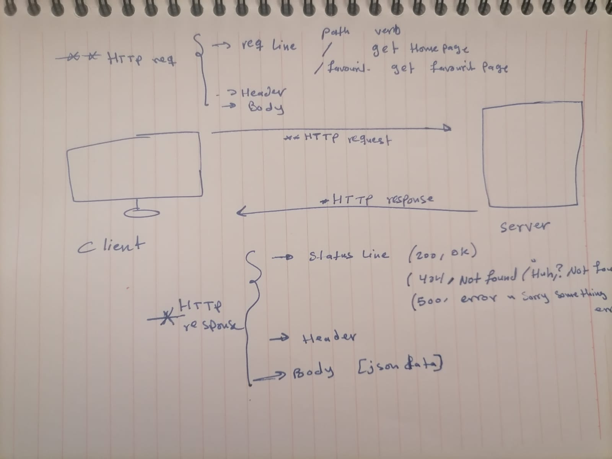

# Movies_Library- Project version: 1.0.0

**Author Name**: Raneem Oqaily

## WRRC

## Overview
setting up the server of the movie app .

## Getting Started
<!-- What are the steps that a user must take in order to build this app on their own machine and get it running? -->

After cloning the repo in the local machine run this command npm ito install all the packages and node-modules

## Project Features
<!-- What are the features included in you app -->
To get Home page that contains data about the movie and to get favourit page .

What observations or questions do you have about what you’ve learned so far?
1. How to install all pachage that needs to start building the server .
2. Get the idea abour wrrc and how the server deal with the reqests .

How long did it take you to complete this assignment? And, before you started, how long did you think it would take you to complete this assignment?
2 hours ,because i faced some problem with the installiation