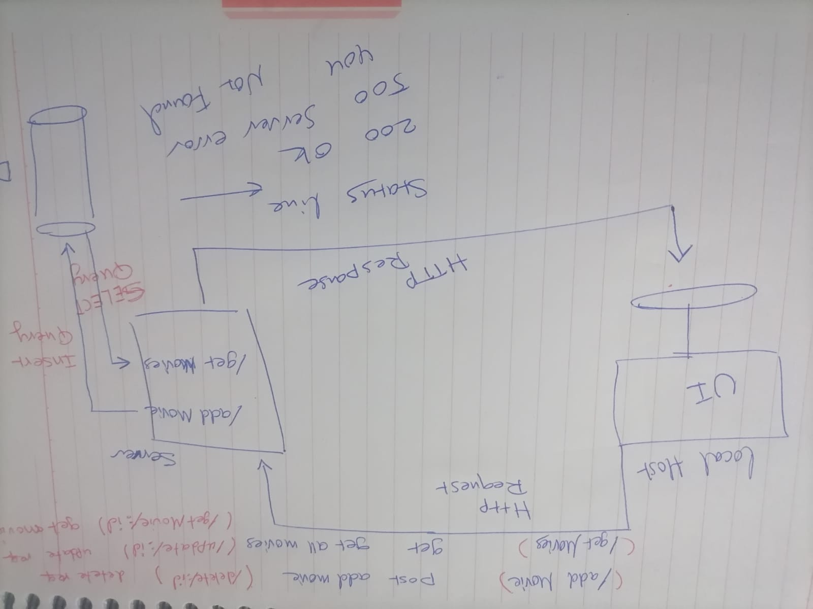

# Movies_Library- Project version: 1.0.0

**Author Name**: Raneem Oqaily

## WRRC

## Overview
setting up the server of the movie app .

## Getting Started
<!-- What are the steps that a user must take in order to build this app on their own machine and get it running? -->
clone repository
cd Movies_Library
npm i  
build their own env variables in their .env file

## Project Features
to get the main page
localhost:7000

to get the favorite page:
localhost:7000/favorite

to get the search page:
localhost:7000/search

to get the review page:
localhost:7000/review

to get thenetwork page:

localhost:7000/network

to update request:
localhost:7000/UPDATE/:id

to delete request:
localhost:7000/DELETE/:id

get request to get a specific movie:
localhost:7000/getMovie/:id

What observations or questions do you have about what you’ve learned so far?
1. How to install all packages that needs to start building the server .
2. Get the idea abour wrrc and how the server deal with the reqests .
3. after this task i had a full imagination web request response cycle and i can make queries to get and insert in the data base  

How long did it take you to complete this assignment? And, before you started, how long did you think it would take you to complete this assignment?

2 hours ,because i faced some problem with the installiation